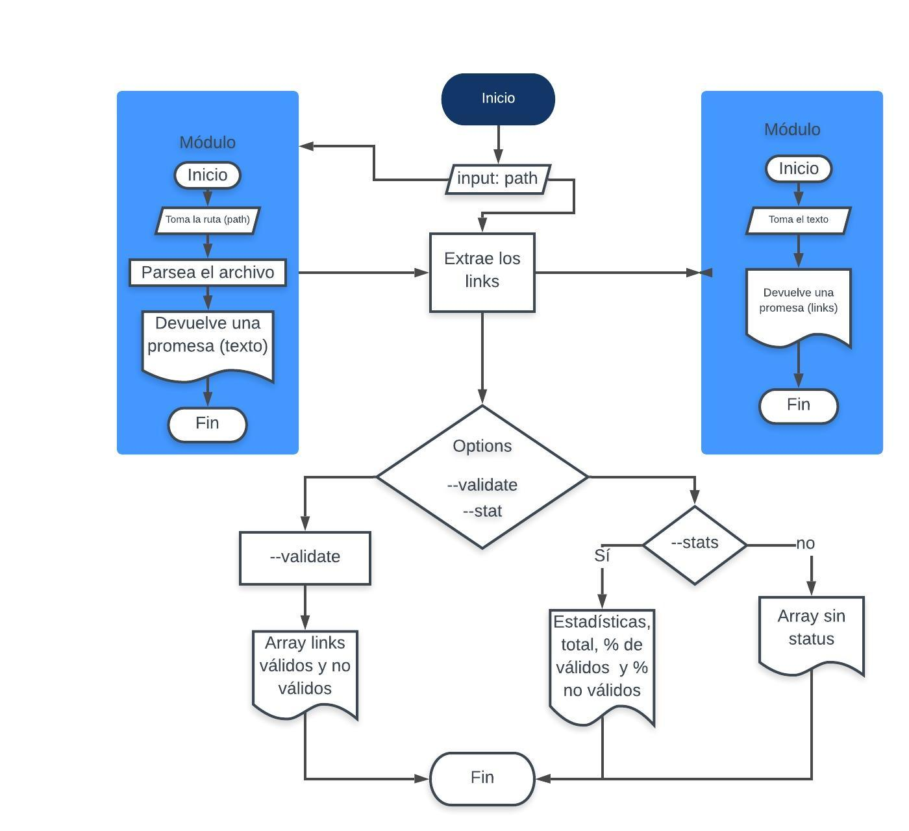

# Markdown Links

[Markdown](https://es.wikipedia.org/wiki/Markdown) es un lenguaje de marcado
ligero muy popular entre developers. Es usado en plataformas que manejan texto plano (GitHub, foros, blogs, ...), y es común encontrar varios archivos en ese formato en cualquier tipo de repositorio (empezando por el tradicional `README.md`).

Por tal motivo Md-Links es una Librería que lee y analiza archivos en formato Markdown, con el propósito de detectar todos los links(vínculos/ligas) que hay en el. Muchas veces estos links están rotos o ya no son válidos y eso perjudica mucho el valor de la información que se quiere compartir.

MD-Links es un programa hecho en Javascript que se ejecuta usando Node.js de la siguiente forma:

